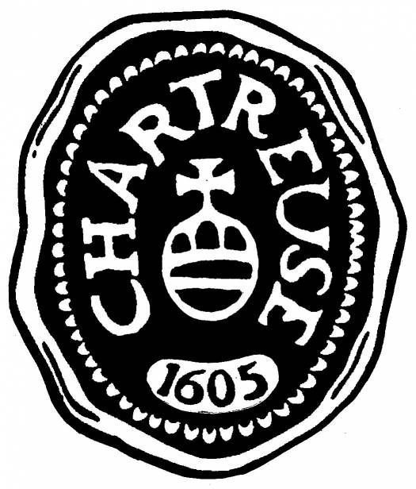
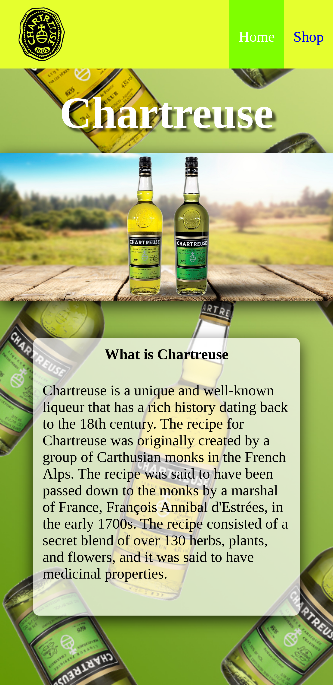
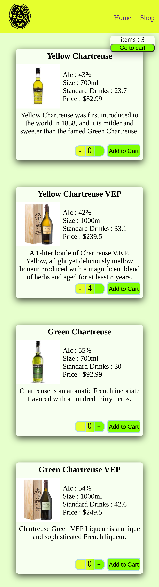
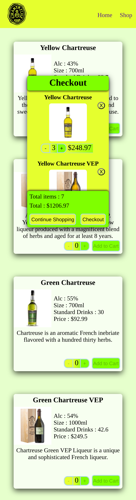

<!-- Improved compatibility of back to top link: See: https://github.com/othneildrew/Best-README-Template/pull/73 -->

<!--
*** Thanks for checking out the Best-README-Template. If you have a suggestion
*** that would make this better, please fork the repo and create a pull request
*** or simply open an issue with the tag "enhancement".
*** Don't forget to give the project a star!
*** Thanks again! Now go create something AMAZING! :D
-->

<!-- PROJECT SHIELDS -->
<!--
*** I'm using markdown "reference style" links for readability.
*** Reference links are enclosed in brackets [ ] instead of parentheses ( ).
*** See the bottom of this document for the declaration of the reference variables
*** for contributors-url, forks-url, etc. This is an optional, concise syntax you may use.
*** https://www.markdownguide.org/basic-syntax/#reference-style-links
-->

[![Contributors][contributors-shield]][contributors-url]
[![Forks][forks-shield]][forks-url]
[![Stargazers][stars-shield]][stars-url]
[![Issues][issues-shield]][issues-url]
[![MIT License][license-shield]][license-url]
[![LinkedIn][linkedin-shield]][linkedin-url]

<!-- PROJECT LOGO -->
 

  

<h3 align="center">Shopping Cart</h3>

  

    project_description
     
    <a href="https://github.com/sirjamo1/shopping-cart"><strong>Explore the docs »</strong></a>
     
     
    <a href="https://sirjamo1.github.io/shopping-cart/">View Demo</a>
    ·
    <a href="https://github.com/sirjamo1/shopping-cart/issues">Report Bug</a>
    ·
    <a href="https://github.com/sirjamo1/shopping-cart/issues">Request Feature</a>
  

<!-- TABLE OF CONTENTS -->

  
Table of Contents

  <ol>
    <li>
      <a href="#about-the-project">About The Project</a>
      <ul>
        <li><a href="#built-with">Built With</a></li>
      </ul>
    </li>
    <li><a href="#contact">Contact</a></li>
    <li><a href="#acknowledgments">Acknowledgments</a></li>
  </ol>

<!-- ABOUT THE PROJECT -->

## About The Project

Shopping cart was created for The Odin Project

Features 

-   Client side navigation
-   Jest tested
-   Add/edit/delete items from cart

<ol>
   <li>Create a new project with create-react-app and get rid of the boilerplate as in the previous projects.</li>
   <li>Think about the component and the folder structure. How could you set up your application? Which components or functionalities do you need?</li>
   <li>You should have at least two pages (a homepage and a shop page, which includes your shopping cart). Let a user navigate between the pages with a navigation bar, which will be shown on both routes.</li>
   <li>To your homepage, you can add whatever you’d like! A few images or information will be totally fine; it doesn’t have to be something fancy. The main goal of the project is to focus on setting up the shopping cart. The homepage is there to practice routing using react-router-dom.</li>
   <li>On your shopping cart route, a user should see a sticky bar (it can be just a top section as well), which displays the number of items currently in the cart. You should also have a button next to it where you can go to the cart to checkout and pay (however we are not going to implement this logic here).</li>
   <li>Build individual card items for each of your products. Display an input field on it, which lets a user manually type in how many items they want to buy. Also, add an increment and decrement button next to it for fine-tuning. You can also display a title for each product as well as an “Add To Cart” button.</li>
   <li>Once a user has submitted their order, the amount on the cart itself should adjust.</li>
   <li>Make sure to test your app thoroughly using the React Testing Library. Take care that you don’t directly test react-router-dom, since it is an external library and the developers working on it must have tested the library already.</li>
   <li>As usual, style your application so you can show it off!</li>
   <li>Lastly, push the project to GitHub! Follow this link for instructions on how to deploy React applications with client-side routing to Github Pages. Be aware that the page will stay blank, unless you provide a basename to the <BrowserRouter />. For a more detailed description, read this part of the React Router docs.</li>
</ol>

(<a href="#readme-top">back to top</a>)

### Built With

-   [![React][react.js]][react-url]
-   Jest

(<a href="#readme-top">back to top</a>)

<!-- ROADMAP -->

## Roadmap

-   [ ] Feature 1
-   [ ] Feature 2
-   [ ] Feature 3
    -   [ ] Nested Feature

See the [open issues](https://github.com/sirjamo1/shopping-cart/issues) for a full list of proposed features (and known issues).

(<a href="#readme-top">back to top</a>)

<!-- CONTACT -->

## Contact

James Howells - jam_how@hotmail.com

Project Link: [https://sirjamo1.github.io/shopping-cart/](https://sirjamo1.github.io/shopping-cart/)

(<a href="#readme-top">back to top</a>)

(<a href="#readme-top">back to top</a>)

<!-- MARKDOWN LINKS & IMAGES -->
<!-- https://www.markdownguide.org/basic-syntax/#reference-style-links -->

[contributors-shield]: https://img.shields.io/github/contributors/sirjamo1/shopping-cart.svg?style=for-the-badge
[contributors-url]: https://github.com/sirjamo1/shopping-cart/graphs/contributors
[forks-shield]: https://img.shields.io/github/forks/sirjamo1/shopping-cart.svg?style=for-the-badge
[forks-url]: https://github.com/sirjamo1/shopping-cart/network/members
[stars-shield]: https://img.shields.io/github/stars/sirjamo1/shopping-cart.svg?style=for-the-badge
[stars-url]: https://github.com/sirjamo1/shopping-cart/stargazers
[issues-shield]: https://img.shields.io/github/issues/sirjamo1/shopping-cart.svg?style=for-the-badge
[issues-url]: https://github.com/sirjamo1/shopping-cart/issues
[license-shield]: https://img.shields.io/github/license/sirjamo1/shopping-cart.svg?style=for-the-badge
[license-url]: https://github.com/sirjamo1/shopping-cart/blob/master/LICENSE.txt
[linkedin-shield]: https://img.shields.io/badge/-LinkedIn-black.svg?style=for-the-badge&logo=linkedin&colorB=555
[linkedin-url]: https://linkedin.com/in/
[product-screenshot]: images/screenshot.png
[next.js]: https://img.shields.io/badge/next.js-000000?style=for-the-badge&logo=nextdotjs&logoColor=white
[next-url]: https://nextjs.org/
[react.js]: https://img.shields.io/badge/React-20232A?style=for-the-badge&logo=react&logoColor=61DAFB
[react-url]: https://reactjs.org/
[vue.js]: https://img.shields.io/badge/Vue.js-35495E?style=for-the-badge&logo=vuedotjs&logoColor=4FC08D
[vue-url]: https://vuejs.org/
[angular.io]: https://img.shields.io/badge/Angular-DD0031?style=for-the-badge&logo=angular&logoColor=white
[angular-url]: https://angular.io/
[svelte.dev]: https://img.shields.io/badge/Svelte-4A4A55?style=for-the-badge&logo=svelte&logoColor=FF3E00
[svelte-url]: https://svelte.dev/
[laravel.com]: https://img.shields.io/badge/Laravel-FF2D20?style=for-the-badge&logo=laravel&logoColor=white
[laravel-url]: https://laravel.com
[bootstrap.com]: https://img.shields.io/badge/Bootstrap-563D7C?style=for-the-badge&logo=bootstrap&logoColor=white
[bootstrap-url]: https://getbootstrap.com
[jquery.com]: https://img.shields.io/badge/jQuery-0769AD?style=for-the-badge&logo=jquery&logoColor=white
[jquery-url]: https://jquery.com
